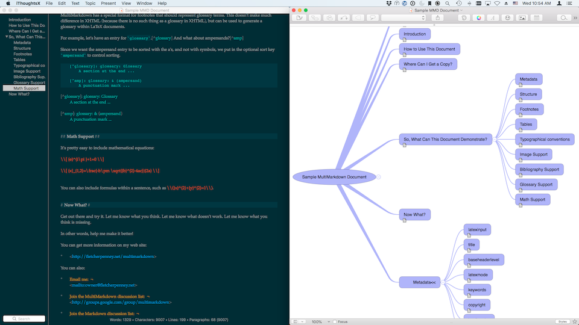

Title:	MultiMarkdown File Formats  
Author:	Fletcher T. Penney  
Revised:	2018-10-10  
Base Header Level:	2  
Transclude Base:	.
CSS:	https://fletcher.github.io/MultiMarkdown-6/css/document.css  
MMD Header:	{{TOC}}  
MMD Footer:	{{../links.txt}}  
LaTeX Config:	tufte-handout  
HTML header:	
<link rel="stylesheet" href="https://cdnjs.cloudflare.com/ajax/libs/highlight.js/9.12.0/styles/default.min.css">

# File Formats #

## Plain Text ##

The most common file format for containing Markdown/MultiMarkdown text is a plain text file.  There is nothing special about these files, though things do tend to work best using:

*	UTF-8 encoding
*	UNIX-style line endings (`\n`)

I've tried to make MultiMarkdown as forgiving as possible when alternatives are used, but if you're having trouble with specific files, this can be a place to start.

## OPML ##

[OPML](https://en.wikipedia.org/wiki/OPML), or Outline Processor Markup Language, is an XML file format used for storing outlines.  This fits well with the idea of a Markdown document containing multiple levels of headers that provide structure to the document, such as:

	# Introduction #
	## Historical Background ##
	## Current State ##
	# Technical Issues #
	## Production Capacity ##
	## Resolution Limits ##
	etc.

MultiMarkdown has had support for OPML for many years (almost as long as MultiMarkdown has been around), but the support in v6 is improved.  Not only is OPML one of the output formats (allowing conversion of plain text into an OPML file), but MultiMarkdown can now read directly from an OPML file in order to convert to something else:

	multimarkdown --opml file.opml > file.html

This means that you can work on your document using an editor that supports OPML (e.g. [MultiMarkdown Composer](https://multimarkdown.com/)), or you can use an outliner or mind-mapping program that supports OPML (most of them do, to varying degrees).  When you're ready to publish your work, you can simply process it like normal to create HTML, LaTeX, etc.

An advantage of this approach is that you can easily rearrange the structure of your document by dragging and dropping sections of the outline.  (While not a full features outlining program, MultiMarkdown Composer allows you to do this as well.)

## ITMZ ##

ITMZ is the file format used by the [iThoughts](https://www.toketaware.com/) line of mind-mapping programs.  It is similar to the OPML format, but is a compressed bundle format rather than a plain text XML file.

## Advanced Use ##

A key reason for the inclusion of the ITMZ format is to demonstrate the functionality provided by tightly coupling the idea of a text editor and an outliner/mind-mapping program.

For example, version 4.5 of MultiMarkdown Composer will include read/write support for both OPML and ITMZ as native document formats.  Which means that you can work on a Markdown/MultiMarkdown document in Composer, while simultaneously opening the same ITMZ in iThoughts as a mind-map (or OPML as an outline in OmniOutliner.)  Which means that you quickly switch applications to view (or rearrange) the overall structure of your document in a visual program (outliner, mind-mapping) while using a text-based editor for writing the content.

